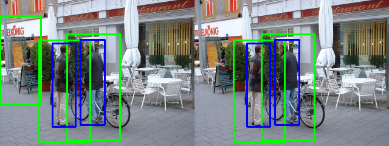

# [DEPRECATED] CNN people detection
## DO NOT USE
This was a university project, and should not be used for any real purpose. Much better alternatives are:
- [YOLO](https://pjreddie.com/darknet/yolo/)
- [Detectron](https://github.com/facebookresearch/Detectron)

## About
This project uses a simple convolutional neural network (CNN) to improve the performance of a HOG detector at detecting pedestrians.

The CNN is trained on a combination of several pedestrian detection datasets to detect whether a image is of a pedestrian or not.
It is then used to filter out false positives emitted by the HOG detector.

This image illustrates the removal of a false positive. The image on the left shows the output of the HOG detector, while the image on the right is the output of the combined filter. In both images, green rectangles show the bounding boxes emitted by the relevant detector, while blue boxes are manually tagged ground truth bounding boxes provided with the dataset.

## Dependencies:
This code is written for python3 and requires the following libraries:
- OpenCV 3.1+
- Tensorflow
- NumPy

## Directory structure
The structure of this directory is as follows:
- "train_person_classification.py":
  Trains and saves the convolutional neural network using a training subset of the datasets.
- "test_person_classification.py":
  Evaluates the performance of the convolutional neural network on a testing subset of the datasets.
- "hog_cnn.py":
  An implementation of the whole algorithm.
- "display_dataset.py":
  A script that displays the images loaded from a dataset.
- "Datasets/":
  Code to load various common pedestrian detection datasets into a common class structure.
- "Model.py":
  Describes the neural network model.
